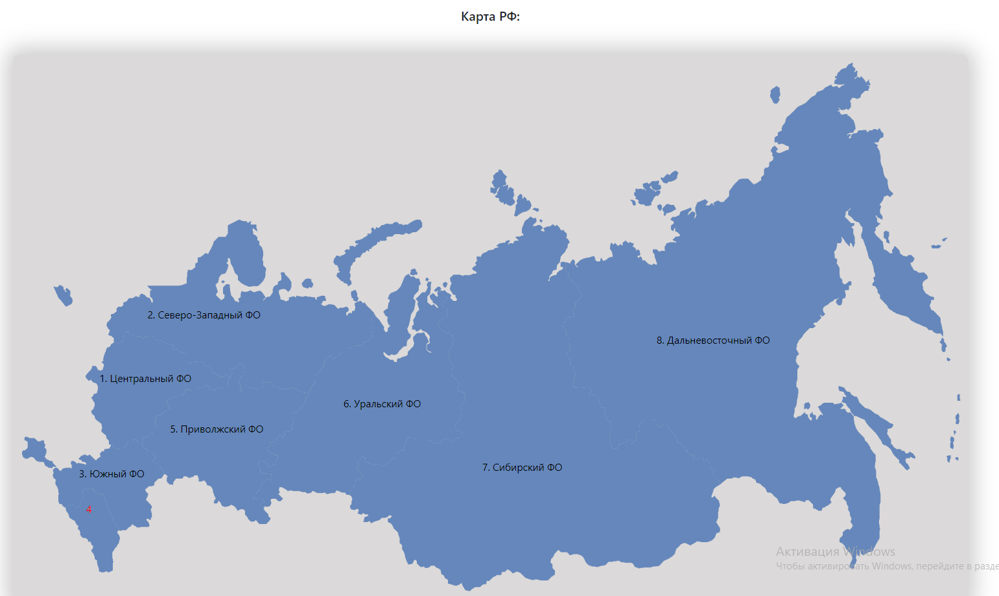
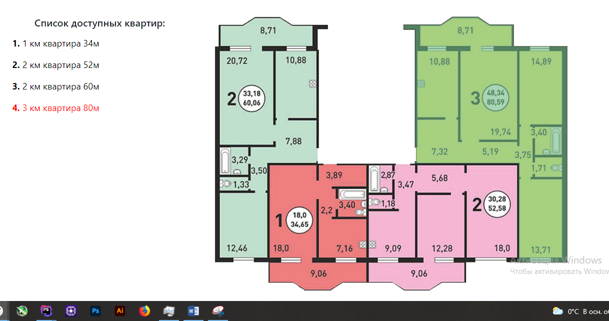

# Пример работы с SVG графикой

Карта svg, с маленькими возможностями котрые позвоялет svg. Векторы нарисованы в adobe illustrator
>__Пример можно посмотреть на странице:__
>[Ссылка на страницу просмотра](https://vladjutnik.github.io/js-after-before/)
>---
>__Или примеры:__
>
>